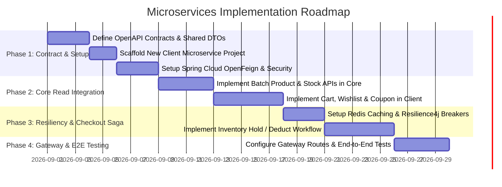

# Microservices Architecture & Integration Plan: Cart/Client Service vs Core Product Service

**Project**: `Ecom-homes-and-merry` Ecosystem  
**Architecture Type**: Distributed Microservices  
**Components**:
1. **Core / Catalog Service** (`Ecom-homes-and-merry`): Products, Inventory, Pricing, Categories, Admin/CRM.
2. **Client / Storefront Service** (New Microservice): Client Carts, Wishlists, Coupons, Checkout, and User Sessions.

---

## 1. High-Level Architecture Diagram

```mermaid
flowchart TD
    subgraph ClientLayer["Frontend & Mobile Apps"]
        FE["Storefront UI / Mobile App"]
    end

    subgraph GatewayLayer["API Gateway & Auth"]
        GW["API Gateway (Spring Cloud Gateway)<br/>- JWT Verification<br/>- Rate Limiting<br/>- Request Routing"]
    end

    subgraph ServiceLayer["Microservices Layer"]
        subgraph ClientService["Client Service (New Microservice)"]
            CS_API["Cart & Wishlist Controller"]
            CS_Coupon["Coupon Engine"]
            CS_Order["Checkout / Order Service"]
            CS_Feign["Product / Inventory Feign Client"]
            CS_DB[("Client DB<br/>- Cart & CartItems<br/>- Wishlists<br/>- Coupons<br/>- Orders")]
        end

        subgraph CoreService["Core / Catalog Service (Existing)"]
            PS_API["Product & Inventory API"]
            PS_Inv["Inventory Management"]
            PS_Pricing["Pricing Engine"]
            PS_DB[("Core DB<br/>- Products<br/>- Inventory<br/>- Pricing<br/>- Categories")]
        end
    end

    subgraph EventBusLayer["Async Messaging & Cache"]
        Kafka["Kafka / RabbitMQ<br/>(Order Placed, Stock Deducted, Cart Events)"]
        Redis["Redis Cache<br/>(Product Snapshots, Session Tokens)"]
    end

    FE -->|HTTP / Bearer Token| GW
    GW -->|/api/v1/client/**| CS_API
    GW -->|/api/v1/products/**| PS_API

    CS_API --> CS_Feign
    CS_Feign -->|REST via OpenFeign / gRPC<br/>(Product details, stock check)| PS_API

    CS_API --> CS_DB
    PS_API --> PS_DB

    CS_Order -.->|Publish: OrderPlacedEvent| Kafka
    Kafka -.->|Consume: DeductStock| PS_Inv

    CS_Feign -.-> Redis
```

---

## 2. Service Responsibilities & Boundaries

| Service | Primary Responsibilities | Data Owned |
| :--- | :--- | :--- |
| **New Client Service** (`client-storefront-service`) | • Cart Operations (Add, Update, Remove, Clear)<br/>• Move to Wishlist / Move to Cart<br/>• Promo & Coupon validation / application<br/>• Checkout session orchestration<br/>• Order creation | • `cart`, `cart_item`<br/>• `wishlist_item`<br/>• `coupon`, `coupon_usage`<br/>• `order`, `order_item` |
| **Existing Core Service** (`ecom-core-service`) | • Product Catalog Master data<br/>• Inventory master & physical stock levels (`current_stock`)<br/>• Product Pricing & GST rates<br/>• Category taxonomies<br/>• Internal logistics / vendors | • `product`<br/>• `inventory`<br/>• `pricing`<br/>• `specifications`, `media`<br/>• `categories` |

---

## 3. How the Two Services Interact (Communication Strategy)

In a microservices architecture, we combine **Synchronous (REST / OpenFeign / gRPC)** and **Asynchronous (Event-Driven via Kafka / RabbitMQ)** patterns:

### 3.1 Synchronous Communication (Read & Validation Flows)
Used during active user browsing, viewing cart, and calculating totals:

1. **Spring Cloud OpenFeign**:
   - `Client-Service` defines declarative HTTP clients to query `Core-Service`:
     ```java
     @FeignClient(name = "core-service", url = "${services.core.url}")
     public interface ProductCatalogClient {

         @GetMapping("/api/v1/products/internal/{productId}")
         ProductSummaryDTO getProductForCart(@PathVariable("productId") Long productId);

         @PostMapping("/api/v1/inventory/check-stock")
         StockAvailabilityResponse checkStockAvailability(@RequestBody List<StockCheckItem> items);
     }
     ```
2. **When it is triggered**:
   - **`POST /api/v1/client/{client_id}/cart/items`**: `Client-Service` calls `Core-Service` to fetch unit price, GST rate, product name, and confirm `quantity <= current_stock`.
   - **`GET /api/v1/client/{client_id}/cart`**: `Client-Service` calls `Core-Service` in batch (`/api/v1/products/batch`) to fetch the latest prices and real-time stock for all items in the cart.

---

### 3.2 Asynchronous Communication (Post-Payment & Mutation Flows)
Used when actions must be decoupled and resilient to service downtime:

1. **Order Placed & Stock Deduction Event**:
   - When a client finishes payment in `Client-Service`, it publishes `OrderPaymentSuccessEvent` to Kafka.
   - `Core-Service` consumes the event and executes:
     `current_stock = current_stock - quantity`
   - If stock falls below `minimum_stock_level`, `Core-Service` raises a procurement alert.
2. **Product Price/Discontinue Update Event**:
   - If admin updates product prices or disables a product in `Core-Service`, it emits `ProductUpdatedEvent`.
   - `Client-Service` clears any cached product pricing in Redis or flags the cart item as invalid.

---

## 4. Database Strategy & Data Isolation

### 4.1 Database-per-Service Pattern (Recommended)
Each service must have its **own independent database schema**:
- **`client_db`**: Stores carts, cart items, wishlists, and orders.
- **`core_db`**: Stores products, inventory, pricing, categories, and media.

#### Why NEVER share a single DB directly between microservices?
- Shared DB creates tight schema coupling (changing a column in `product` can break `Client-Service`).
- DB connection pools and CPU bottlenecks in one service affect the other.
- Independent database deployment and horizontal scaling becomes impossible.

---

### 4.2 Handling Data Duplication vs. Live Queries
To maintain high performance without bombarding `Core-Service` on every keystroke:

1. **Cart Item Schema in `Client-Service`**:
   The `CartItem` table stores reference IDs and lightweight snapshots:
   ```sql
   CREATE TABLE cart_item (
       id BIGINT PRIMARY KEY AUTO_INCREMENT,
       cart_id BIGINT NOT NULL,
       product_id BIGINT NOT NULL,
       sku_id VARCHAR(100) NOT NULL,
       quantity INT NOT NULL,
       added_price DECIMAL(10, 2) NOT NULL,
       updated_at TIMESTAMP
   );
   ```
2. **Hydration Pattern**:
   When `GET /cart` is called, `Client-Service` fetches the items from `cart_item`, calls `Core-Service` (or Redis cache) to hydrate real-time product names, images, active selling prices, and stock availability, and computes the dynamic pricing summary.

---

## 5. Critical Engineering Considerations ("What needs to be taken care of?")

### 5.1 Security & Authentication (JWT Context Propagation)
- **Shared Secret / Public Key (RSA / JWKS)**:
  Both services should decode the JWT using the same public key / signing secret, or the API Gateway should validate the token and pass trusted user headers:
  - `X-User-Id: 5`
  - `X-User-Role: RETAIL_CUSTOMER`
  - `X-User-Email: customer@example.com`
- **Feign Client Header Forwarding**:
  When `Client-Service` calls `Core-Service`, a `RequestInterceptor` must forward the `Authorization: Bearer <token>` or use a dedicated `Service-to-Service API Key` (`X-Service-Token: core-internal-secret`).

---

### 5.2 Stock Race Conditions & Payment Sagas
- **Problem**: Two customers add the last chair in stock simultaneously. Both proceed to checkout.
- **Solution (Two-Phase Stock Lifecycle)**:
  1. **Cart Phase**: Non-blocking soft check (`quantity <= current_stock`).
  2. **Payment Init (Reserve Phase)**: Reserve stock with a 15-minute Time-To-Live (TTL) hold:
     `POST /api/v1/inventory/hold` (`hold_id`, `expires_at`).
  3. **Payment Success (Commit Phase)**: Finalize deduction and release hold.
  4. **Payment Failed / Timeout (Release Phase)**: Release held stock back to available pool.

---

### 5.3 Network Resiliency & Fault Tolerance
What happens if `Core-Service` is slow or temporarily down?
1. **Resilience4j Circuit Breaker**:
   Wrap Feign calls with Circuit Breaker and Timeout (e.g. 1.5s timeout).
2. **Fallback Strategy**:
   If `Core-Service` is unreachable during `GET /cart`, serve the cart with cached prices and a warning banner: *"Live stock verification is currently unavailable. Please refresh before checkout."*
3. **Retry with Exponential Backoff**:
   Auto-retry transient network glitches (max 3 retries).

---

### 5.4 API Versioning & Distributed Tracing
1. **Correlation ID (`X-Correlation-ID` / `Trace-ID`)**:
   Pass a unique Trace ID from API Gateway $\rightarrow$ `Client-Service` $\rightarrow$ `Core-Service` $\rightarrow$ Kafka. This enables distributed tracing across log files (using OpenTelemetry / Micrometer Tracing / Zipkin).
2. **Health Checks & Discovery**:
   Use Eureka / Consul or Kubernetes DNS for service discovery.

---

## 6. Phased Implementation Roadmap



---

## 7. Next Steps & Summary Checklist

- [x] **Step 1**: Scaffold `ecom-client-service` with dependencies: `Spring Web`, `Spring Data JPA`, `Spring Security`, `Spring Cloud OpenFeign`, `Lombok`, `MySQL/H2`.
- [x] **Step 2**: Expose internal batch query & stock hold/deduct endpoints in `ecom-homes-and-merry` (`POST /api/v1/products/internal/batch-summary`, `POST /api/v1/inventory/internal/hold-stock`).
- [x] **Step 3**: Implement Cart, Wishlist & Order JPA entities in `client_db`.
- [x] **Step 4**: Implement dynamic Pricing, Coupon evaluation engine & Checkout Saga in `client-service`.
- [x] **Step 5**: Configure Gateway routing, Route Security Filters, and distributed `X-Correlation-ID` trace headers.
